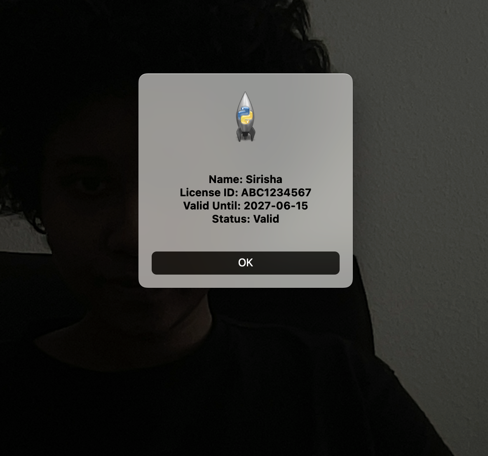
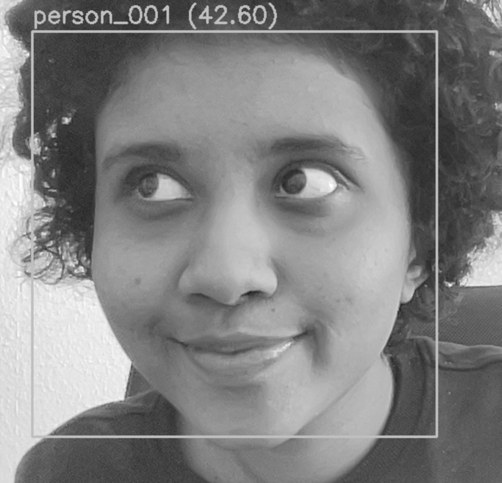

# Face Recognition & License Verification using LBPH

This project implements a real-time **face recognition system** using the **Local Binary Patterns Histogram (LBPH)** algorithm with OpenCV. It captures faces via webcam, trains an identity model, and verifies a person against a known license record.

> 🔬 This is a classic machine learning-based face recognition system — built entirely in Python with no deep learning dependencies.

---

## Algorithms & Approach

- **LBPH (Local Binary Patterns Histogram)**  
  Converts grayscale face images into spatial histograms of local binary patterns, then matches via Euclidean distance.

- **Haar Cascade Classifier**  
  Detects faces in video frames for image capture and real-time recognition.

- **License Database (JSON)**  
  Simple mapping between recognized person IDs and license data (name, expiry date, ID number).

- **OpenCV (cv2)**  
  Handles webcam streaming, face detection, model training, and recognition.

---

## 🛠️ Project Structure

```
Face-Recognition-System/
├── dataset/                  # Face images (generated locally, not pushed)
│   ├── person_001/
│   └── person_002/
├── trainer/                  # LBPH model (ignored in Git)
│   └── lbph_model.yml
├── src/
│   ├── collect_faces.py      # Capture face images
│   ├── train_model.py        # Train LBPH model
│   ├── recognize_live.py     # Real-time face recognition
├── labels.json               # Label → name map
├── licenses.json             # Person ID → license data
├── .gitignore
└── README.md
```

> Note: `dataset/` and `trainer/` are excluded from version control. They are generated locally when the pipeline is run.

---

## Usage Instructions

### Collect Face Images

```bash
python src/collect_faces.py
```

You'll be prompted:

```text
Enter person name (folder name under 'dataset/'): person_001
```

Then:
- Press `'c'` to capture a face sample
- Press `'q'` to stop

Images will be saved to `dataset/person_001/`. Repeat for other users.

---

### Train the LBPH Model

```bash
python src/train_model.py
```

- Reads all folders in `dataset/`
- Trains the LBPH model
- Saves the model to `trainer/lbph_model.yml`
- Saves the label map to `labels.json`

---

### Run Live Face Recognition

```bash
python src/recognize_live.py
```

- Opens the webcam
- Detects faces and matches against trained identities
- On match, displays the license info in a pop-up or overlay

---

## Sample `licenses.json`

```json
{
  "person_001": {
    "Name": "Sirisha",
    "License ID": "ABC1234567",
    "Valid Until": "2027-06-15",
    "Status": " Valid"
  },
  "person_002": {
    "Name": "Alex",
    "License ID": "XYZ9876543",
    "Valid Until": "2026-12-31",
    "Status": "Valid"
  }
}
```

---

## LBPH in a Nutshell

- Grayscale image is divided into cells
- Each cell is converted to a Local Binary Pattern (LBP)
- Histograms of LBP codes are calculated
- Distance between histograms = confidence score
- Lower score = better match

---

## Output Example (Screenshot)

<h3 align="center">🎯 Face Recognition Output – Before & After</h3>

<p align="center">
  
  
</p>


> Output shows:
> - Name + confidence
> - Bounding box around face
> - License info (either as pop-up or frame overlay)

---

## ⚙️ File Outputs (After Running)

| File                | When It's Generated       | Purpose                      |
|---------------------|---------------------------|------------------------------|
| `dataset/`          | after `collect_faces.py`  | Stores captured face images  |
| `trainer/lbph_model.yml` | after `train_model.py`     | Trained LBPH model           |
| `labels.json`       | after `train_model.py`     | Label-to-name mapping        |
| `licenses.json`     | manually provided          | Person → License info map    |

---

## .gitignore Includes

```gitignore
dataset/
trainer/
*.yml
__pycache__/
*.log
```

---

## Accuracy Tips

- Capture 100+ varied images per person
- Vary lighting, angle, expression
- Keep consistent image size (200×200)
- Use histogram equalization if lighting differs

---

## Future Work

- Upgrade to DeepFace or InsightFace (deep learning)
- Add liveness detection to prevent spoofing
- Save access logs with timestamps
- Add expiration validation to licenses
- Deploy with FastAPI + Streamlit for web dashboard

---

## Publication

<p>
  <strong>Face Recognition System</strong><br/>
  <em>National Conference on Advances in Big Data and Cloud Computing (NCABC'19)</em><br/>
  February 21, 2019 – Page 20<br/>
  🔗 <a href="https://sites.google.com/view/ncabc2020/proceedings" target="_blank">View Proceedings</a>
</p>


## Author

@TheDataDesk | Sirisha Padmasekhar 
